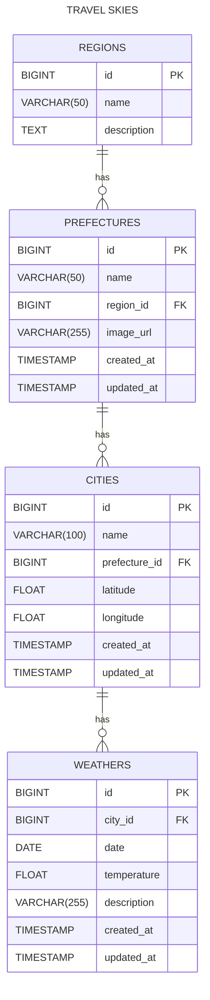

# TRAVEL SKIES

## データベース構成

```mermaid
---
title: "TRAVEL SKIES"
---
erDiagram
    REGIONS {
        BIGINT id PK
        VARCHAR(50) name
        TEXT description
    }

    PREFECTURES {
        BIGINT id PK
        VARCHAR(50) name
        BIGINT region_id FK
        VARCHAR(255) image_url
        TIMESTAMP created_at
        TIMESTAMP updated_at
    }

    CITIES {
        BIGINT id PK
        VARCHAR(100) name
        BIGINT prefecture_id FK
        FLOAT latitude
        FLOAT longitude
        TIMESTAMP created_at
        TIMESTAMP updated_at
    }

    WEATHERS {
        BIGINT id PK
        BIGINT city_id FK
        DATE date
        FLOAT temperature
        VARCHAR(255) description
        TIMESTAMP created_at
        TIMESTAMP updated_at
    }

    REGIONS ||--o{ PREFECTURES : "has"
    PREFECTURES ||--o{ CITIES : "has"
    CITIES ||--o{ WEATHERS : "has"


```
